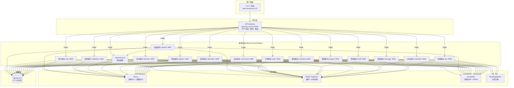
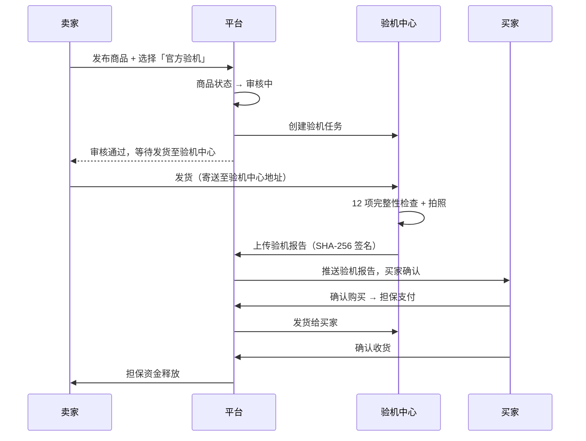
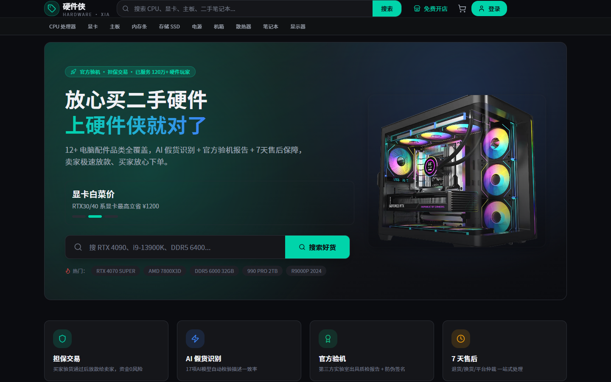
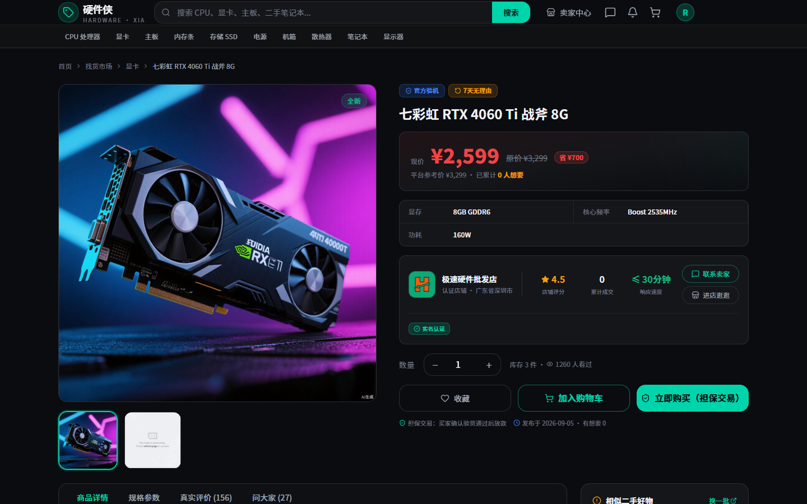
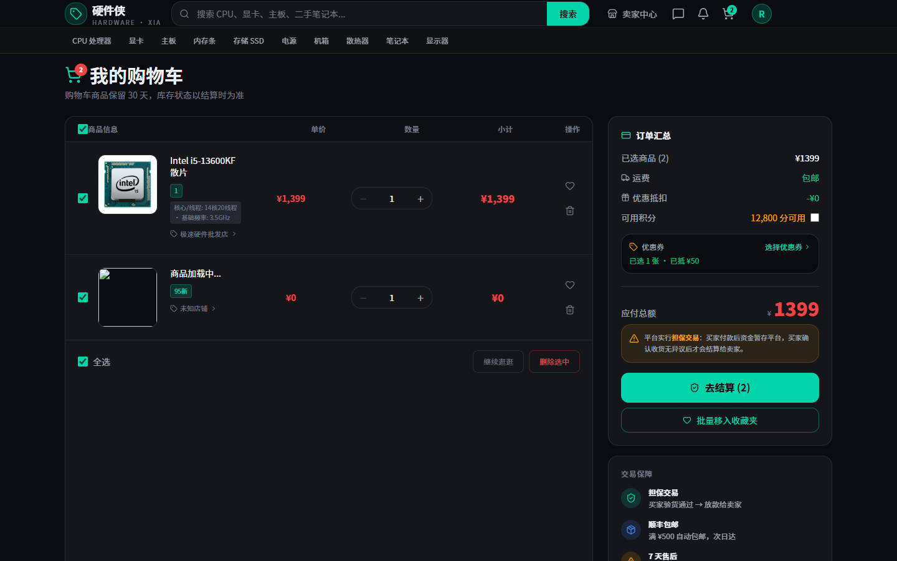
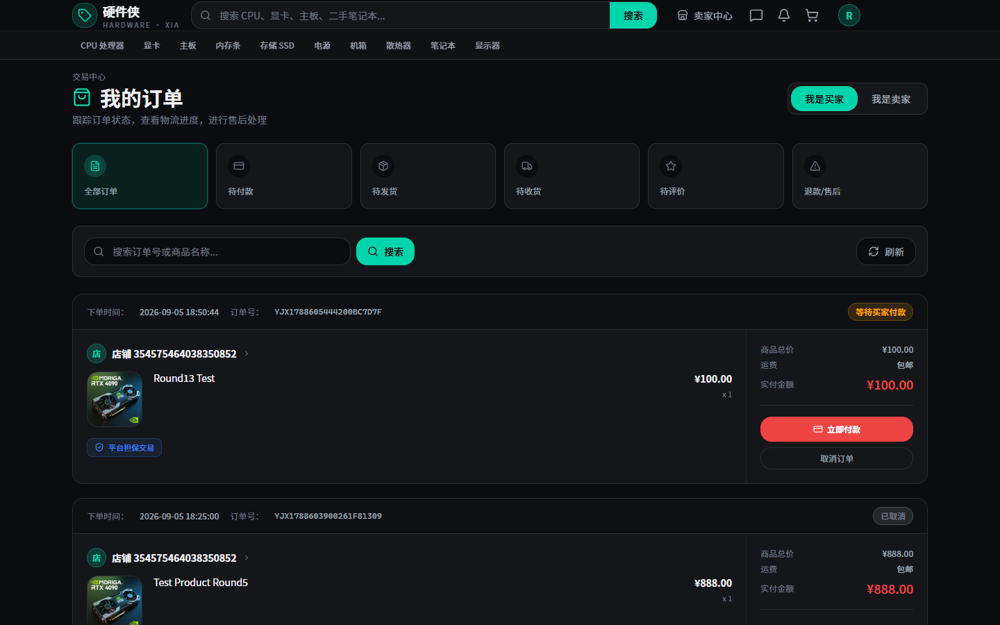
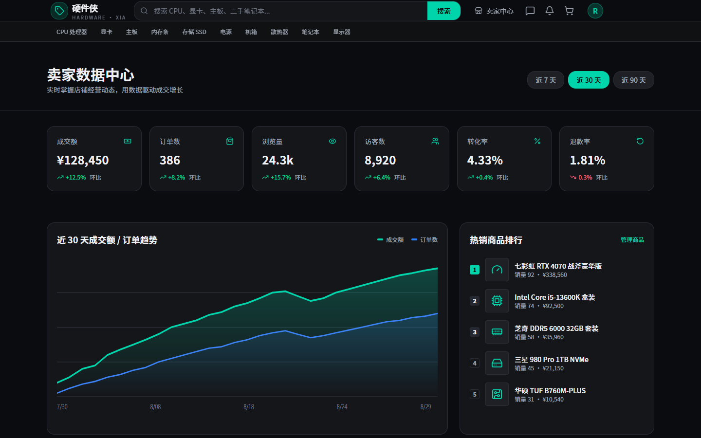

# 硬件侠 (YingJianXia) · C2C 电脑配件二手交易平台

<div align="center">


**C2C 模式 · 验机担保 · 安全可信的二手电脑硬件交易平台**

[本地预览](#-快速开始) · [技术文档](#-架构设计) · [快速开始](#-快速开始)

</div>

---

## 📖 项目简介

**硬件侠** 是一个面向电脑硬件爱好者的 C2C 二手交易平台，致力于解决二手电脑配件交易中的信任难题。平台通过 **官方验机 + 担保交易 + 完整售后** 三大核心机制，让买家买得放心、卖家卖得安心。

### 核心亮点
以下为项目设计目标，当前实现进度见「📌 当前进度」章节。
| 特性 | 说明 |
|------|------|
| 🔍 **官方验机** | 卖家发货至平台验机中心，专业检测后出具 12 项完整性检查的验机报告，支持 SHA-256 数字签名防篡改 |
| 💰 **担保交易** | 买家付款进入平台担保账户，确认收货后资金才释放给卖家，杜绝「钱货两空」 |
| 🛡️ **售后保障** | 7 天无理由退换、假一赔三、运费险，客服介入仲裁 |
| 📊 **信用体系** | 买卖双方信用分 + 评价体系，优质卖家自动获得「金牌店铺」认证 |
| 🤖 **风控拦截** | 基于规则引擎的实时风险控制，识别异常交易和恶意行为 |

> 🤖 **AI 辅助开发声明**：本项目开发过程中使用了 AI 辅助工具（Trae 等），核心架构设计、业务逻辑和代码质量由人工把控。

---

## 🏗️ 架构设计

### 整体架构



### 服务划分（15 个微服务 + 网关）

| 分组 | 服务 | 端口 | 职责 |
|------|------|------|------|
| **P1** | gateway-service | 8080 | API 网关：JWT 鉴权、Sentinel 限流、路由转发、灰度发布 |
| **P2** | user-service | 8081 | 用户注册/登录、个人资料、店铺管理、收货地址、实名认证 |
| | evaluation-service | 8092 | 买家评价、卖家评价统计、信用分计算 |
| **P3** | product-service | 8082 | 商品 CRUD、分类管理、库存、搜索、状态机 |
| | inspection-service | 8083 | 验机流程、12 项完整性检查、SHA-256 签名报告 |
| | audit-service | 8095 | 商品/帖子/举报审核、审核员分配、审核日志 |
| **P4** | order-service | 8084 | 订单创建、状态机、购物车、地址快照 |
| | escrow-service | 8085 | 担保账户、资金冻结/解冻、分账 |
| | payment-service | 8086 | 支付渠道对接、退款、对账 |
| | marketing-service | 8091 | 优惠券、满减、秒杀、促销活动 |
| **P5** | logistics-service | 8087 | 物流跟踪、运单管理、验机中心物流 |
| | aftersales-service | 8088 | 退换货申请、售后流程、仲裁 |
| | message-service | 8089 | 站内信、系统通知、推送 |
| | community-service | 8090 | 帖子、评论、点赞、话题 |
| | support-service | 8093 | 客服工单、FAQ、智能问答 |
| | risk-service | 8094 | 风控规则、异常交易检测、黑白名单 |

### 公共模块

| 模块 | 说明 |
|------|------|
| common-core | 基础实体、统一响应、异常码、工具类 |
| common-web | 全局异常处理、拦截器、幂等校验 |
| common-feign | Feign 客户端封装、降级策略 |
| common-mybatis | MyBatis-Plus 封装、自动填充、逻辑删除 |
| common-mq | RocketMQ + Outbox Pattern 消息可靠性 |

---

## ✨ 功能列表

### 买家端

| 功能 | 说明 |
|------|------|
| 🔐 账号注册/登录 | 手机号 + 密码登录，JWT 双 Token 机制，黑名单登出 |
| 🔍 商品搜索 | 关键词搜索（标题/描述/品牌/分类名）、分类筛选、价格区间、排序 |
| 📦 商品详情 | 多图展示、规格选择、验机报告、卖家店铺、相关推荐 |
| 🛒 购物车 | 多商品批量结算、数量调整、软删除恢复、幂等键防重复 |
| 💰 担保下单 | 地址快照、多商品订单、担保支付、状态跟踪 |
| 📨 订单管理 | 全部订单、待付款/待发货/待收货/已完成、取消/退款 |
| ⭐ 评价系统 | 订单完成后评价、图文评价、好评率统计 |
| 💬 社区互动 | 发帖、评论、点赞、热门话题、排行榜 |
| 🎫 优惠券 | 领取优惠券、下单抵扣 |
| 👤 个人中心 | 资料修改、收货地址、信用分、收藏夹 |

### 卖家端

| 功能 | 说明 |
|------|------|
| 🏪 店铺管理 | 店铺信息、Logo/Banner、店铺认证、服务承诺 |
| 📝 商品发布 | 5 步发布流程、分类/规格/图片、自动保存草稿 |
| ✅ 提交审核 | 提交后状态变为「审核中」，自动通知 audit-service 创建审核记录 |
| 📋 商品管理 | 我的发布列表、上下架、编辑、批量改价/改库存 |
| 📊 经营分析 | 销量统计、收入分析、流量数据 |
| 📦 订单发货 | 订单处理、发货、物流跟踪 |
| 🔄 售后处理 | 退款/退货申请处理、拒绝/同意、退货收货 |
| 🎁 营销推广 | 优惠券创建、促销活动、精选推荐 |

### 平台端（审核/客服）

| 功能 | 说明 |
|------|------|
| 🔎 商品审核 | 待审核列表、审核通过/拒绝、审核意见、证据留存 |
| 🛡️ 举报处理 | 用户举报处理、内容下架 |
| 💬 客服工单 | 工单列表、处理、转派、关闭 |
| 👥 用户管理 | 用户列表、角色管理、封禁/解封 |
| 📢 公告管理 | 平台公告发布 |

### 验机核心流程



---

## 📌 当前进度

> 诚实标注：以下为各模块的真实完成状态，未实现的功能不做夸大宣传。

### ✅ 已完成（核心交易链路跑通）

| 模块 | 功能 | 说明 |
|------|------|------|
| 用户服务 | 注册/登录、JWT 鉴权、个人资料、收货地址、店铺管理、实名认证 | 手机号+密码登录，双 Token 机制 |
| 商品服务 | 商品 CRUD、分类、库存、状态机（草稿→审核→在售→已售） | 5 步发布流程，自动保存草稿 |
| 验机服务 | 验机报告、12 项完整性检查、SHA-256 签名防篡改 | 验机流程完整实现 |
| 订单服务 | 购物车、订单创建、状态机、地址快照 | 幂等键防重复下单 |
| 担保服务 | 钱包、资金冻结/解冻、分账 | 担保交易核心逻辑 |
| 支付服务 | 支付订单、退款、对账 | **模拟支付**，未接入真实渠道 |
| 物流服务 | 运单管理、物流轨迹跟踪 | 多快递公司支持 |
| 售后服务 | 退换货申请、仲裁流程、售后消息 | 完整售后状态机 |
| 消息服务 | 站内信、系统通知、会话管理 | 实时消息 |
| 评价服务 | 买家评价、卖家统计、信用分 | 图文评价 |
| 营销服务 | 优惠券、满减、促销 | 优惠券领取与抵扣 |
| 客服服务 | 工单系统、FAQ | 客服转派与关闭 |
| 风控服务 | 规则引擎、异常交易检测、黑白名单 | 登录/交易风控 |
| 审核服务 | 商品/帖子/举报审核 | 审核员分配与日志 |
| 社区服务 | 帖子、评论、点赞、话题 | 社区互动 |
| API 网关 | JWT 鉴权、Sentinel 限流、路由转发 | 统一入口 |

### 🔄 开发中（已预留接口，待完善）

| 模块 | 说明 |
|------|------|
| 支付渠道对接 | 预留支付宝/微信支付接口，当前为模拟支付，未接入真实渠道 |
| 短信验证码 | 预留短信发送接口，当前使用固定验证码 |
| 文件上传 | 商品图片当前使用 AI 生成 URL，待接入 OSS/本地存储 |
| 搜索引擎 | 商品搜索当前走数据库 LIKE，Elasticsearch 待接入 |

### 📋 规划中

- 分库分表（ShardingSphere 已引入，待配置分片规则）
- 消息队列（RocketMQ 已引入，Outbox 模式待完善）
- 第三方实名认证 API 对接
- 数据统计大屏与经营分析报表

---

## 🖼️ 截图展示

### 核心交易链路

| 首页 | 商品详情 |
|------|----------|
|  |  |

| 购物车 | 订单中心 |
|--------|----------|
|  |  |

| 卖家后台 |
|----------|
|  |

### 登录与搜索

| 登录页 | 搜索 GPU |
|--------|----------|
|  |  |

---

## 🛠️ 技术栈

### 后端

| 分类 | 技术 | 版本 |
|------|------|------|
| 语言 | Java | 17 |
| 框架 | Spring Boot | 3.2.5 |
| 微服务 | Spring Cloud | 2023.0.1 |
| 服务治理 | Spring Cloud Alibaba | 2023.0.1.0 |
| 注册/配置中心 | Nacos | 2.x |
| ORM | MyBatis-Plus | 3.5.5 |
| 分库分表 | ShardingSphere | 5.4.1 |
| 缓存 | Redis + Redisson | 6.x |
| 消息队列 | RocketMQ | 5.1.4 |
| 搜索引擎 | Elasticsearch | 8.13.4 |
| 数据库 | MySQL | 8.0.33 |
| 状态机 | Spring StateMachine | 4.0.0 |
| 限流熔断 | Sentinel | - |
| 网关 | Spring Cloud Gateway | - |
| 工具 | Hutool | 5.8.26 |

### 前端

| 分类 | 技术 | 版本 |
|------|------|------|
| 框架 | Vue | 3.5 |
| 构建工具 | Vite | 8.x |
| 路由 | Vue Router | 5.3 |
| 状态管理 | Pinia | 4.0 |
| 样式 | Tailwind CSS | 4.3 |
| HTTP | Axios | 1.20 |
| 图标 | Lucide Vue | 1.0 |

---

## 🚀 快速开始

### 环境要求

- JDK 17+
- MySQL 8.0+
- Redis 6.0+
- Nacos 2.x
- Maven 3.6+
- Node.js 18+

### 环境变量配置

所有敏感配置通过环境变量注入，以下是需要配置的环境变量清单（均有本地开发默认值，生产环境务必修改）：

| 环境变量 | 说明 | 默认值（开发） |
|----------|------|----------------|
| `NACOS_SERVER` | Nacos 服务地址 | `127.0.0.1:8848` |
| `NACOS_NAMESPACE` | Nacos 命名空间 | `public` |
| `NACOS_USERNAME` | Nacos 用户名 | `nacos` |
| `NACOS_PASSWORD` | Nacos 密码 | `nacos` |
| `MYSQL_HOST` | MySQL 主机 | `127.0.0.1` |
| `MYSQL_PORT` | MySQL 端口 | `3306` |
| `MYSQL_USER` | MySQL 用户名 | `root` |
| `MYSQL_PWD` | MySQL 密码 | `123456` |
| `REDIS_HOST` | Redis 主机 | `127.0.0.1` |
| `REDIS_PORT` | Redis 端口 | `6379` |
| `REDIS_PWD` | Redis 密码 | `123456` |
| `JWT_SECRET` | JWT 签名密钥 | `yingjianxia-jwt-secret-please-change-in-production` |
| `INTERNAL_SECRET` | 服务间内部调用密钥 | `yjx-internal-secret-please-change-in-production` |

> ⚠️ 生产环境必须通过环境变量覆盖 `MYSQL_PWD`、`REDIS_PWD`、`JWT_SECRET`、`NACOS_PASSWORD`、`INTERNAL_SECRET`，切勿使用默认值。

### 1. 启动中间件

```bash
# Nacos (standalone 模式)
cd middleware/nacos/bin
./startup.cmd -m standalone

# Redis
cd middleware/redis
redis-server.exe redis.windows.conf
```

### 2. 初始化数据库

```bash
# 执行所有建表脚本
cd hardware-architecture-design/sql
mysql -u root -p < 00_init_all.sql
```

### 3. 启动后端

```bash
cd yingjianxia-backend

# 编译
mvn clean install -DskipTests

# 启动网关
java -jar gateway-service/target/gateway-service-1.0.0-SNAPSHOT.jar --spring.profiles.active=dev

# 依次启动各微服务（建议按 P1→P2→P3→P4→P5 顺序）
```

或使用启动脚本：

```bash
cd yingjianxia-backend/scripts
./start-all.ps1
```

### 4. 启动前端

```bash
cd yingjianxia-vue
npm install
npm run dev
```

### 5. 访问

| 服务 | 地址 |
|------|------|
| 前端 | http://localhost:5173 |
| 网关 | http://localhost:8080 |
| Nacos | http://localhost:8848/nacos |

### 测试账号

| 角色 | 账号 | 密码 |
|------|------|------|
| 买家/卖家 | 13900001234 | 12345678 |
| 卖家 | 13800001111 | 12345678 |
| 审核员 | 13800002001 | 12345678 |

---

## 📁 项目结构

```
trae/
├── yingjianxia-backend/          # 后端微服务
│   ├── gateway-service/          # API 网关
│   ├── user-service/             # 用户服务
│   ├── product-service/          # 商品服务
│   ├── inspection-service/       # 验机服务
│   ├── order-service/            # 订单服务
│   ├── escrow-service/           # 担保服务
│   ├── payment-service/          # 支付服务
│   ├── logistics-service/        # 物流服务
│   ├── aftersales-service/       # 售后服务
│   ├── message-service/          # 消息服务
│   ├── community-service/        # 社区服务
│   ├── marketing-service/        # 营销服务
│   ├── evaluation-service/       # 评价服务
│   ├── support-service/          # 客服服务
│   ├── risk-service/             # 风控服务
│   ├── audit-service/            # 审核服务
│   └── common-*/                 # 公共模块 (core/web/feign/mybatis/mq)
│
├── yingjianxia-vue/              # 前端
│   ├── src/
│   │   ├── api/                  # API 封装
│   │   ├── views/                # 页面组件 (30+)
│   │   ├── stores/               # Pinia 状态管理
│   │   ├── components/           # 公共组件
│   │   └── router/               # 路由配置
│   └── package.json
│
├── hardware-architecture-design/ # 架构设计文档
│   └── sql/                      # 数据库建表脚本
│
├── screenshots/                  # 截图
└── 硬件侠核心链路截图/            # 核心流程截图
```

---

## 🧠 核心设计

### 状态机

商品和订单均采用状态机管理，状态流转受控、可追溯：

**商品状态**：`草稿 → 审核中 → 在售 / 已拒绝 → 已售 / 已下架`

**订单状态**：`待付款 → 待发货 → 待收货 → 已完成 / 已取消`（售后分支：退款中 → 已退款）

### 幂等设计

- 所有写操作要求携带 `X-Idempotency-Key` 请求头
- 订单创建幂等键格式：`deduct_{productId}_{specId}_{xid}`
- 数据库层唯一约束保证

### 消息可靠性

采用 **Outbox Pattern**：业务数据与消息写入同一事务，由后台任务扫描 Outbox 表投递至 RocketMQ，保证「业务成功则消息必达」。

### 数据安全

- 验机报告 SHA-256 数字签名，防止篡改
- 用户密码 BCrypt 加密存储
- 手机号加密存储，展示脱敏（139****1234）

---

## 📮 联系方式

- 公众号：一只爱玩游戏的猿
- GitHub：通过 Issues / Discussions 私信联系

---

## 📝 License

本项目基于 [MIT License](LICENSE) 开源。

---

<div align="center">

**硬件侠** — 让二手硬件交易更放心

Made with ❤️ by 硬件侠团队

</div>
